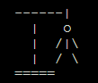

# Lord of the Rings Hangman Game - ReadME

[Access the live site here.](https://lotr-hangman-82b016ba1627.herokuapp.com/)

This is the documentation for the Lord of the Rings. Built using Python for the Milestone 3 Project for Code Institutes Web Development Diploma course. 

******

## Contents

* [The User Experience](#the-user-experience)
    * [Strategy](#strategy)
    * [Scope](#scope)
    * [Structure](#structure)
    * [Skeleton](#skeleton)
* [The User Interface](#the-user-interface)
    * [Surface](#surface)
* [Features](#features)
    * [Navigation](#navigation)
    * [Game Interface](#game-interface)
    * [Correct/Incorrect Results](#correctincorrect-results)
    * [Guessed Letters](#guessed-letters)
* [Future Implementations](#future-implementations)
* [Technologies Used](#technologies-used)
* [Deployment and Local Development](#deployment-and-local-development)
    * [Deployment](#deployment)
    * [Local Deployment](#local-deployment)
* [Testing](#testing)
    * [Validation](#validation)
    * [Manual Testing](#manual-testing)
* [Issues/Bugs](#issues\/bugs)
    * [Fixed Issues](#fixed-issues)
    * [Known Bugs](#known-bugs)
* [Credits](#credits)
    * [Help Used](#help-used)
    * [Acknowledgements](#acknowledgements)

******

## The User Experience

### Strategy

This project is designed with the aim to showcase the my skills and progression in learning the Python coding language through the Code Institute web development diploma course with a simple game, using my own resources and knowledge to create a LOTR themed Hangman game to showcase my abilities and create a user friendly interface.

#### - User Stories

**First Time Visitor goals** -

a. As a first time visitor I want to be able to easily understand how to play the game.

b. I want to be able to easily see what characters I have got right and wrong and what characters I have already guessed.

c. I want to be able to have the option to play again.

**Returning Visitor goals** -

a. As a returning visitor I want to be able to play the game without having to view the instructions.

b. I don't want to guess words I have already guessed.

**Frequent Visiter goals** -

a. As a frequent visitor I want to see visual updates and new features being added to the game.

******

### Scope

Taking the user goals into account I decided to add colour to the text when the player guesses a right or wrong character to make it easier to see if the player was right.

I add a function so all the words played in one session would not be used again until the word library had been completed.

I also added the option to play again or return to the intro page if the player wanted to view the instructions.

The player can chose to view the instructions on the intro page or jump straight into the game.

******

### Structure

The game is simple and loads with the option to view the instructions on how to play. Once the game interface is loaded, a hangman diagram is displayed to show the current status/lives and is updated with each incorrect guess. The hidden word is displayed underneath the diagram with each letter replaced with an uderscore to simulate the hidden word. Each time the player guesses a correct character the hidden word is updated and the characters are shown in their appropriate place. When the player guesses the whole word, either as a whole or through individual characters, a winning message is displayed and the player has the option to play again. If the loser runs out of lives and the hangman diagram is completed they are shown a losing message, again, with the option to play again.

******

#### Skeleton

### Workflow Diagram

The workflow diagram has been created using [Canva](https://www.canva.com/).

Workflow Diagram

The diagram shown here is for the initial logic workflow of the game.

[*Back to top*](#contents)

******

## The User Interface

### Surface

#### Colours

**GREEN** - I chose to display correct guesses in green to make it easier for the player to distinguish between correct and incorrect guesses as green usually reads as correct.

**RED** - I chose to display incorrect guesses in red to make it easier for the player to distinguish between correct and incorrect guesses as red usually reads as incorrect.

**BLUE** - I chose to display guessed letters in blue to make it easier to distinguish from the rest of the text on screen and is a fairly neutral colour.

******

#### Typewriter Effect

I included a typewriter effect for the introduction to the game and the instructions to give the user a better experience than just having a sudden block of text appear.

******

#### Clear Screen

I included a clear screen function after each guess to keep the page from being too cluttered and making it easier to see whats going on.

[*Back to top*](#contents)

******

## Features

### Navigation

The game gives the player the option to view instructions or jump straight into the game. The game also asks the player if they want to play again on completion of the game. Both of these questions are answered by entering either Y or N. The game will give an incorrect input message if the user enters anything other than Y or N and will also convert lowercase to uppercase to stop the player having to type in capslock.

### Game Interface

Hangman Start

Hangman End (Game Losee)

The Game Interface is ran in the console due to the nature of Python. Because of this the interface is very basic and just shows text. The hangman diagram is made from a mixture of slashes, vertical bars and equals signs.

### Correct/Incorrect Results

Correct Result

Incorrect Result

The result element only appears when the player has guessed a letter. The result text is coloured to depict whether the player got the answer correct or incorrect (Correct being green and Incorrect being red).

### Guessed Letters

Guessed Letters

The guessed letters are displayed below the hangman image and above the hidden word and are coloured blue to make them easier to distinguish. The list is updated after each of the players guesses so the player doesn't need to try and remember what letters they have already guessed.

## Future Implementations

1. To use classes to store the word dictionary to stop the program having to go to the Google spreadsheet everytime a new word is required.

2. To refactor the main_game function to make it easier to read and more understandable.

[*Back to top*](#contents)

******

## Technologies Used

### Languages Used

**Python** - The whole game has been made using Python.

******

### Frameworks, Programs and Libraries Used

[**Visual Studio Code**](https://code.visualstudio.com/) - All coding of the game was done using VSCode.

[**GitPod**](https://gitpod.io/) - To host the local server used and to save files to the GitHub Repository.

[**GitHub**](https://github.com/) - To save and store files for the website.

**Git** - For version control.

[**Heroku**](https://heroku.com/) - For game deployment.

[**Canva**](https://www.canva.com/) - For workflow diagram during game design period.

[**UI.Dev**](https://ui.dev/amiresponsive) - To show the website on various screen sizes.

[**Google Sheets**](https://www.google.co.uk/sheets/about/) - To host the spreadsheet used to store hidden words.

[*Back to top*](#contents)

******

## Deployment and Local Development

### Deployment

This project was deployed using Code Institute's mock terminal for Heroku.

The steps for deployment are:

    1. Create a new Heroku app with a unique name and the region

    2. In the "settings" tab, set the buildpacks to 'Python' and 'NodeJS' (the order is important)

    3. Link the Heroku app to the GitHub repository

    4. In case it is wished, enable "automatic deploys" to automaticly update the app in case of a new commit

    5. Click on Deploy in the "manual deploy" area

******

### Local Deployment

#### How to Fork

1. Log in to [GitHub](https://github.com/).

2. Find the repository for [this project](https://github.com/Craig90Dev/lotr-hangman).

3. Click the Fork button in the top right corner of the screen.

#### How to Clone

1. Log in to [GitHub](https://github.com/).

2. Find the repository for [this project](https://github.com/Craig90Dev/lotr-hangman).

3. Click the Code button and select whether you would like to clone with HTTPS, SSH or GitHub CLI. Copy the link displayed.

4. Open the terminal in your code editor and change the current working directory to the location you want to use for the cloned directory.

5. Type 'git clone' into the terminal and then paste the link you copied in step 3.

[*Back to top*](#contents)

******

## Testing

### Validation

Python Validataion

[PEP8](https://pep8ci.herokuapp.com/) was used to validate the Python code for the game via the direct input. Final editing has been done to ensure all results produced were error free.

******

### Manual Testing

| Feature | Expected Outcome | Testing Performed | Result | Pass/Fail |
| --- | --- | --- | --- | --- |
| Y or N Validation | Only accepts Y or N as an input. "You entered: X" message displays otherwise | Entered characters that weren't Y or N | "You entered: X" message displays | Pass |
| Multiple Char Validation | Only accepts 1 char for Y or N questions. "Invalid" message displays otherwise | Entered multiple chars | "Invalid" message displays | Pass |
| Multiple Char Guess | When guessing chars, input accepts either 1 char or multiple chars if length of hidden word, error message otherwise | Guessed 1 char, multiple chars not equal to length of hidden word and multiple chars equal to length of hidden word | Input accepts 1 char and multiple chars same as hidden word length. Error message if multiple chars not same as hidden word length | Pass |
| Instuctions | When asked to view instructions, Y shows instructions, N jumps straight to game | Entered both Y and N | When Y entered, instructions show. When N entered, jumps to game | Pass |
| Play Again | When asked to play again, Y starts new game, N takes player to intro | Entered both Y and N | When Y entered, starts new game. When N entered, takes player to intro | Pass |
| Incorrect Guess | When player guesses an incorrect char, "Incorrect" message displays and hangman diagram updates | entered incorrect char | Displays "Incorrect" message and hangman diagram updates | Pass |
| Correct Guess | When player guesses a correct char, "Correct" message displays and hidden word updates | entered correct char | Displays "Correct" message and hidden word updates | Pass |
| Guessed Letters | When player guesses a letter, guessed letters updates | Guessed letters | Guessed letters update | Pass |

[*Back to top*](#contents)

## Issues/Bugs

### Fixed Issues

| Issue | How It Was Resolved | Fixed? |
| --- | --- | --- |
| Guessed word wasn't matching hidden word, even though it was correct | After adding a space between the hidden letters (underscores) for easier readability, I'd forgotten I'd have to remove the spaces for the hidden word in order for them to to match. "if hidden_word.replace(" ", "") == word:" | Fixed |

### Known Bugs

No known bugs at this stage of development.

[*Back to top*](#contents)

******

## Credits

### Help Used

[Replit](https://ask.replit.com/t/how-do-i-make-colored-text-in-python/29288) - For the coloured text used.

[Nihal Patel, PlainEnglish.io](https://python.plainenglish.io/typewriter-animation-using-python-7f4275e812bf) - For the typewriter effect used.

[Code Institute, Love Sandwiches Walkthrough Project] - For setting up and deploying the game.

[Tarandeep singh, Scaler.com](https://www.scaler.com/topics/how-to-clear-screen-in-python/) - For the clear screen function.

******

### Acknowledgements

Dick Vlaanderen (Mentor) - For the advice and encouragement I have received throughout the creation of the game.

The Slack community - For help needed with various questions and problems I had throughout the project.

[*Back to top*](#contents)